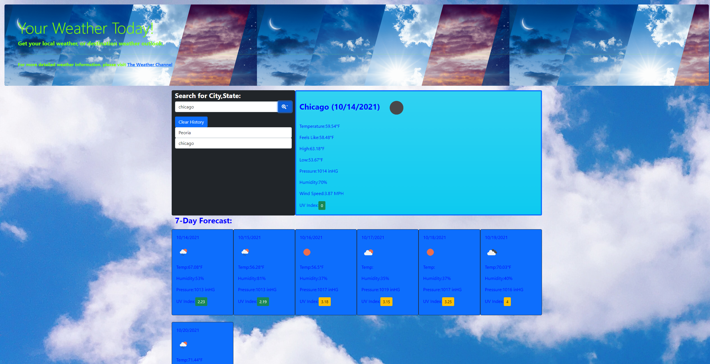

# Weather-Dashboard
This is a simple weather dashboard that shows the current and future forecast for the city that is searched.

## Live installation

https://silversssc.github.io/Weather-Dashboard/

## Installation

Use git clone to clone this repository to your local drive

'''bash
git clone "insert repo"
'''

## References
Inspiration from 3rd party:
    - https://github.com/RyanEllingson/Weather-Dashboard
    - https://github.com/sahiljanbandhu/Weather-Dashboard

## Contributing
Pull requests are welcome. For major changes, please open an issue first to discuss what you would like to change.

Please make sure to update tests as appropriate.

## License
[MIT](https://choosealicense.com/licenses/mit/)

## Contact
CFrank306@gmail.com
https://github.com/SilverSSSC
